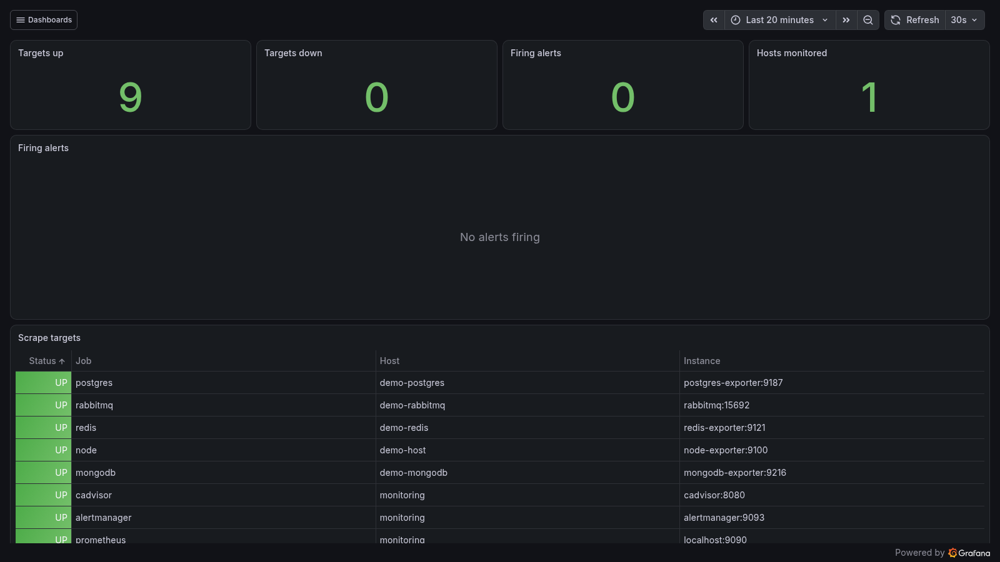
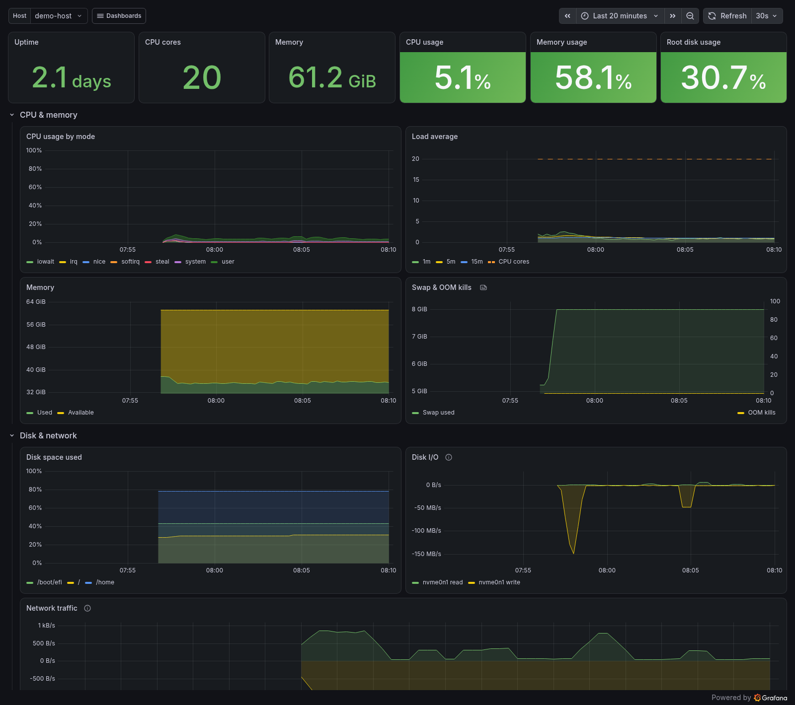
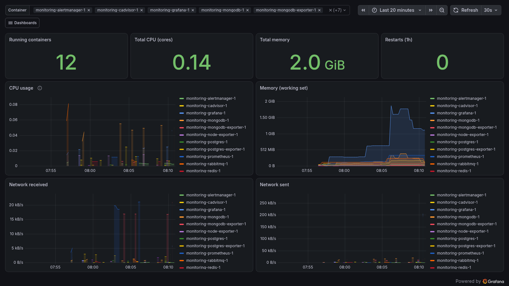
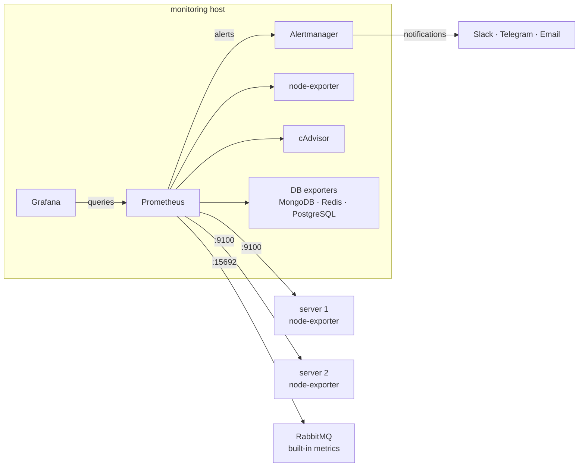

# Docker monitoring stack: Prometheus, Grafana, Alertmanager

A production-ready monitoring stack for Linux servers and Docker hosts, in one
`docker compose up`. Dashboards and alert rules are provisioned as code, so
the whole setup lives in git and can be rebuilt on a new server in minutes.

[](https://github.com/mariusbancos/docker-monitoring-stack/actions/workflows/validate.yml)

## What you get

- **Prometheus** with 30-day retention and file-based target discovery: add a server by adding one line, no restart.
- **Grafana** with provisioned dashboards: an overview of targets and firing alerts, host metrics, and per-container metrics.
- **Alertmanager** with ready-to-use routes for Slack, Telegram and email, with secrets kept out of git.
- **22 alert rules** for hosts, containers, MongoDB, Redis, PostgreSQL, RabbitMQ and the stack itself, with unit tests.
- **node-exporter** and **cAdvisor** for the host the stack runs on, and a one-file setup for remote servers.
- **Optional exporters** for MongoDB, Redis and PostgreSQL, enabled with Compose profiles.
- **CI** that validates every config file and runs the alert rule tests on each push.

All images are pinned to specific versions. UIs listen on `127.0.0.1` by default.

## Screenshots

**Overview**: every scrape target and every firing alert on one page.



**Hosts**: CPU, memory, disk and network for each server, with a host picker.



**Containers**: per-container CPU, memory, network and restarts from cAdvisor.



## Architecture



## Quick start

Requirements: a Linux host with Docker Engine and the Compose plugin.

```bash
git clone https://github.com/mariusbancos/docker-monitoring-stack.git
cd docker-monitoring-stack
cp .env.example .env        # set GRAFANA_ADMIN_PASSWORD
make up                     # or: docker compose up -d
```

| Service      | URL                    |
|--------------|------------------------|
| Grafana      | http://localhost:3000  |
| Prometheus   | http://localhost:9090  |
| Alertmanager | http://localhost:9093  |

On a remote server, reach them through an SSH tunnel
(`ssh -L 3000:localhost:3000 user@server`) or put a reverse proxy with TLS in front of Grafana.

### Try everything locally

The demo starts sample MongoDB, Redis, PostgreSQL and RabbitMQ instances with all
exporters enabled, so every dashboard and alert rule has data:

```bash
make demo         # start
make demo-down    # stop and delete demo data
```

## Monitoring more servers

1. On each server, start node-exporter with [`remote/node-exporter.compose.yml`](remote/node-exporter.compose.yml),
   and allow port 9100 only from the monitoring host.
2. Add the server to [`prometheus/targets/node.yml`](prometheus/targets/node.yml):

   ```yaml
   - targets: [10.0.1.10:9100]
     labels:
       host: web-1
   ```

Prometheus re-reads target files automatically. The `host` label is what you see in
Grafana and in alert messages.

## Databases and queues

| Service    | How                                                                                  | Target file                    |
|------------|--------------------------------------------------------------------------------------|--------------------------------|
| MongoDB    | `docker compose --profile mongodb up -d`, set `MONGODB_URI` in `.env`               | `prometheus/targets/mongodb.yml`  |
| Redis      | `docker compose --profile redis up -d`, set `REDIS_ADDR` in `.env`                  | `prometheus/targets/redis.yml`    |
| PostgreSQL | `docker compose --profile postgres up -d`, set `POSTGRES_DSN` in `.env`             | `prometheus/targets/postgres.yml` |
| RabbitMQ   | `rabbitmq-plugins enable rabbitmq_prometheus` on the broker, no exporter needed      | `prometheus/targets/rabbitmq.yml` |

Use a dedicated read-only user for each exporter.

## Alerts

| Group       | Alerts |
|-------------|--------|
| Hosts       | HostDown, HostDiskAlmostFull, HostDiskWillFillIn24h, HostHighMemoryUsage, HostOomKill, HostHighCpuUsage |
| Containers  | ContainerRestartLoop, ContainerNearMemoryLimit |
| MongoDB     | MongoDBDown, MongoDBReplicationLag, MongoDBConnectionsHigh |
| Redis       | RedisDown, RedisMemoryNearLimit, RedisRejectedConnections |
| PostgreSQL  | PostgresDown, PostgresConnectionsHigh |
| RabbitMQ    | RabbitMQResourceAlarm, RabbitMQQueueBacklog |
| Stack       | TargetDown, PrometheusConfigReloadFailed, PrometheusRuleEvaluationFailures, AlertmanagerNotificationsFailing |

Thresholds favour fewer, actionable alerts: most rules need the condition to hold for
several minutes before firing. A critical alert suppresses the matching warning, and
`HostDown` suppresses everything else on that host.

### Sending notifications

Alerts are visible in Grafana and the Alertmanager UI out of the box. To get notified,
uncomment one or more integrations in [`alertmanager/alertmanager.yml`](alertmanager/alertmanager.yml)
and put the secret in `alertmanager/secrets/` (git-ignored):

```bash
echo -n 'https://hooks.slack.com/services/...' > alertmanager/secrets/slack_webhook_url
docker compose restart alertmanager
```

## Changing things

| Task                       | Do                                                                 |
|----------------------------|--------------------------------------------------------------------|
| Add or remove a target     | Edit `prometheus/targets/*.yml` (picked up automatically)           |
| Change an alert rule       | Edit `prometheus/rules/*.yml`, then `make check` and `make reload`  |
| Change routing             | Edit `alertmanager/alertmanager.yml`, then `docker compose restart alertmanager` |
| Upgrade a component        | Bump the image tag in `docker-compose.yml`, then `make up`          |

`make check` validates the Prometheus and Alertmanager configuration and runs the alert
rule unit tests in [`prometheus/tests/`](prometheus/tests/), the same checks CI runs.

## Repository layout

```
├── docker-compose.yml           # the stack
├── docker-compose.demo.yml      # sample databases for local testing
├── Makefile                     # up, down, demo, check, reload
├── prometheus/
│   ├── prometheus.yml
│   ├── rules/                   # alert rules
│   ├── targets/                 # what to scrape
│   └── tests/                   # promtool unit tests for the rules
├── alertmanager/
│   ├── alertmanager.yml
│   └── secrets/                 # webhook URLs, tokens (git-ignored)
├── grafana/
│   ├── provisioning/            # data sources and dashboard provider
│   └── dashboards/              # dashboard JSON
├── remote/
│   └── node-exporter.compose.yml
├── demo/targets/                # scrape targets used by the demo
└── .github/workflows/           # CI: validates configs, runs rule tests
```

## License

MIT
